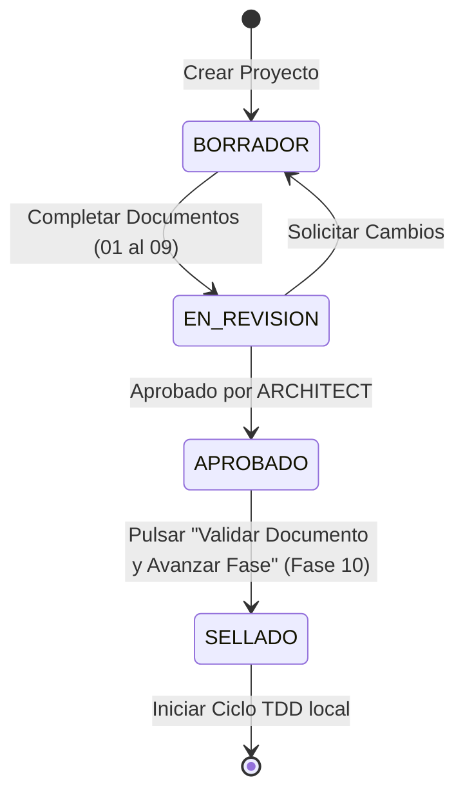

# 07. Workflows Operativos de Negocio

Este documento describe el flujo operativo de aprobación y sellado de especificaciones en el framework.

## Flujo de Aprobación de Especificación y Sellado

El ciclo de vida de un diseño técnico (plano arquitectónico) culmina con su sellado formal antes del desarrollo:

Para más detalles, consulte el archivo [aprobacion-especificacion.md](file:///c:/sdd-tdd-framework/docs/workflows/aprobacion-especificacion.md).
