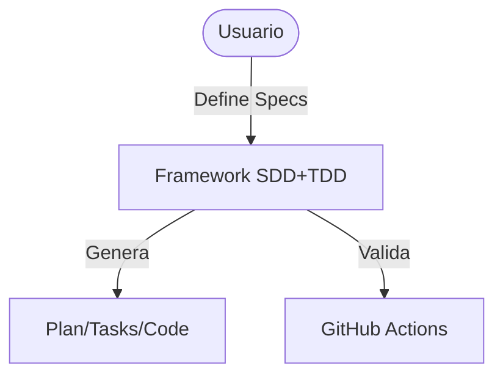

# docs/architecture/context.md
## Diagrama de Contexto (C4 Nivel 1)

Este sistema orquesta el desarrollo con IA.

```mermaid
graph TD
    User([Usuario]) -- Define Specs --> System[Framework SDD+TDD]
    System -- Genera --> Artifacts[Plan/Tasks/Code]
    System -- Valida --> CI[GitHub Actions]
```
